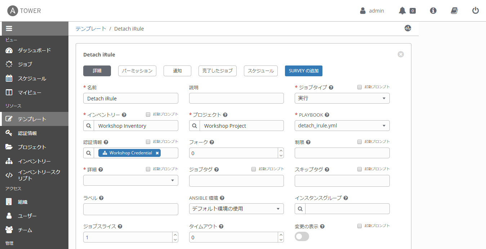
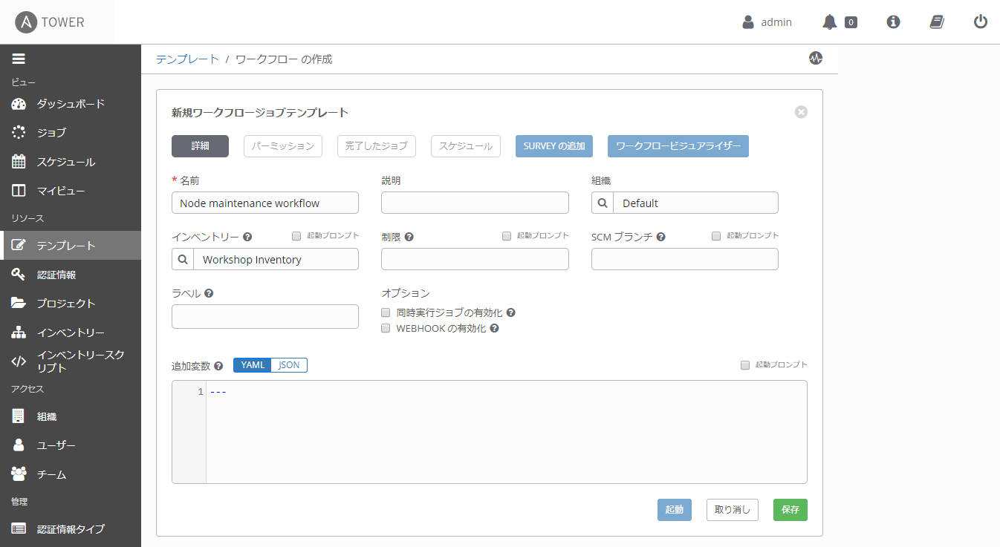
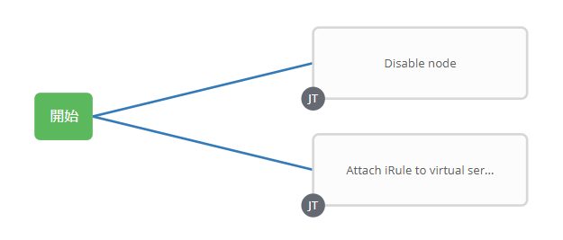
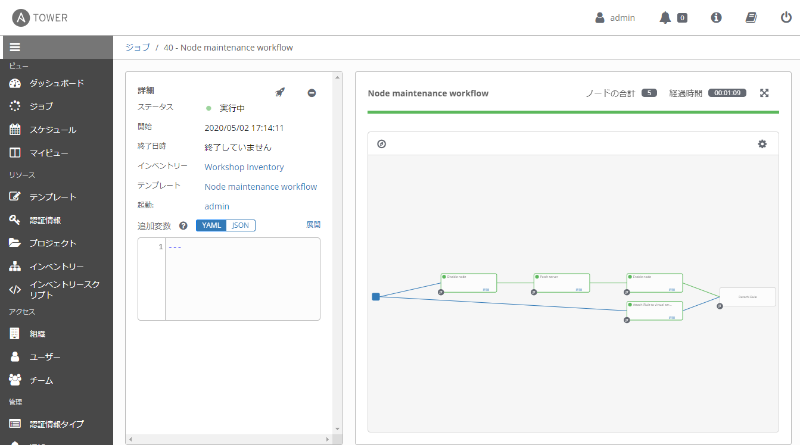

# 演習 4.3: ノードメンテナンスワークフローの作成

**Read this in other languages**:  [English](README.md),   [日本語](README.ja.md).

## 目次

- [目的](#目的)
- [解説](#解説)
- [まとめ](#まとめ)
- [完了](#完了)

# 目的

F5 BIG-IPの[Ansible Tower ワークフロー](https://docs.ansible.com/ansible-tower/latest/html/userguide/workflows.html)のユースケースを示します。

この演習では、サーバーのパッチ管理のワークフローを作成します。最初にプールメンバーを無効にし、ノードにパッチを適用してから、ノードを有効にします。同時に、iRule を仮想サーバーに接続して、サーバーがメンテナンス中であることをユーザーに応答します。

# 解説

## Step 1: ジョブテンプレートの準備

前の`演習 4.1`と同様に、以下のテンプレートを準備する必要があります:

| ジョブテンプレート名           | Playbook         |
|--------------------------------|------------------|
| Disable node                   | disable_node.yml |
| Enable node                    | enable_node.yml  |
| Patch server                   | patch_server.yml |  
| Attach iRule to virtual server | attach_irule.yml |  
| Detach iRule                   | detach_irule.yml |

ここでも、`演習 4.1` と同様に `Patch server` を除き、上記の各テンプレートは同じテンプレートパラメータを使用します。このテンプレートは `Workshop Credential` 認証情報を利用し、他の全てのテンプレートは `BIGIP` を使用します。

| パラメータ     | 値                  |
|----------------|---------------------|
| 名前           |                     |
| ジョブタイプ   | 実行                |
| インベントリー | Workshop Inventory  |
| プロジェクト   | Workshop Project    |
| Playbook       |                     |
| 認証情報       |                     |

設定されたテンプレートの例を次に示します。

## Step 2: ワークフローテンプレートの作成

1. 左側のメニューバーから **テンプレート** をクリックします。

2. 緑色のボタンをクリックし、新しく **ワークフローテンプレート** を作成します。

3. 以下の通りにパラメータを入力します。

| パラメータ     | 値                        |
|----------------|---------------------------|
| 名前           | Node maintenance workflow |
| 組織           | Default                   |
| インベントリー | Workshop Inventory        |

4. **保存** ボタンをクリックします。

## Step 3: ワークフロービジュアライザー

1. **保存** ボタンをクリックすると、**ワークフロービジュアライザー** が自動的に開きます。もしそうでない場合、青い **ワークフロービジュアライザー** ボタンをクリックします。

2. デフォルトでは、緑色の **開始** ボタンのみが表示されます。**開始** ボタンクリックします。

3. 右側に **ノードの追加** が表示されます。

## Step 4: *Disable node* ジョブテンプレートの追加

1. **`Disable node`** ジョブテンプレートを選択します。実行オプションは、`常時` を使用します。

2. 緑色の **選択** ボタンをクリックします。

    

## Step 5: *Attach iRule to virtual server* ジョブテンプレートの追加

1. もう一度 **開始** ボタンをクリックします。**ノードの追加** が再び表示されます。

2. **`Attach iRule to virtual server`** ジョブテンプレートを選択します。**実行** パラメータは、ドロップダウンメニューから **常時** を選択します。

3. 緑色の **選択** ボタンをクリックします。

   

## Step 6: *Patch server* ジョブテンプレートの追加

1. **`Disable node`** ノードにカーソルを合わせ、緑色の **+** 記号をクリックします。**ノードの追加** が再び表示されます。

2. **`Patch server`** ジョブテンプレートを選択します。**実行** パラメータは、ドロップダウンメニューから **成功時** を選択します。

3. 緑色の **選択** ボタンをクリックします。

   

## Step 7: *Enable node* ジョブテンプレートの追加

1. **`Patch server`** ノードにカーソルを合わせ、緑色の **+** 記号をクリックします。**ノードの追加** が再び表示されます。

2. **`Enable node`** ジョブテンプレートを選択します。**実行** パラメータは、ドロップダウンメニューから **成功時** を選択します。

3. 緑色の **選択** ボタンをクリックします。

   

## Step 8: *Detach iRule* ジョブテンプレートの追加

1. **`Enable node`** ノードにカーソルを合わせ、緑色の **+** 記号をクリックします。**ノードの追加** が再び表示されます。

2. **`Detach iRule`** ジョブテンプレートを選択します。**実行** パラメータは、ドロップダウンメニューから **成功時** を選択します。

3. 緑色の **選択** ボタンをクリックします。

   

## Step 9: コンバージドリンクの作成

最後に、並行して実行されているジョブを収束できるようにするリンクを作成します。つまり、両方のジョブが完了すると、`Detach iRule`ノードがトリガーされます。

1. **`Attach iRule to virtual server`** ノードの上にカーソルを置き、青いチェーン記号をクリックします。

2. 次に、**Detach iRule** をクリックします。リンクの追加ウィンドウが表示されます。**実行** パラメータには、**常時** を選択します。

3. 緑色の **保存** ボタンをクリックします。

4. 緑色の **保存** ボタンをもう一度クリックし、ワークフローを保存します。

## Step 10: ワークフローの実行

1. **テンプレート** ウインドウに戻ります。

2. ロケットをクリックし、**`Node maintenance workflow`** ワークフローテンプレートを起動します。

   

    ワークフロージョブの実行中はいつでも、ノードをクリックして個々のジョブテンプレートを選択し、ステータスを確認できます。

仮想サーバーにiRuleをアタッチすると、サーバーのメンテナンス時にメンテナンスページが表示されます。
   

# まとめ

あなたは学習しました

 - プールメンバーを無効にし、Webサーバーをアップグレードし、サーバーをプールに戻すワークフローテンプレートを作成しました
 - iRuleを仮想サーバーに接続し、ユーザーはサーバーのパッチ中にメンテナンスページが表示されます
 - ワークフローテンプレートを起動し、**ワークフロービジュアライザー**を確認しました

---

# 完了

演習 4.3 を完了しました。

これで本演習は終わりです。[演習ガイドへ戻る](../README.ja.md)
