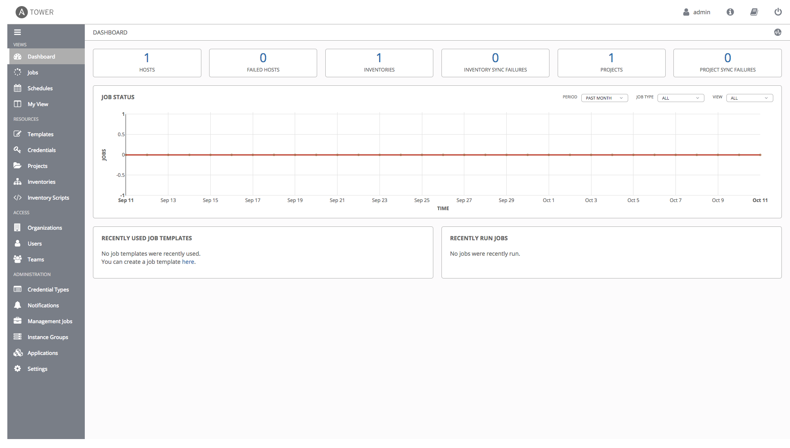
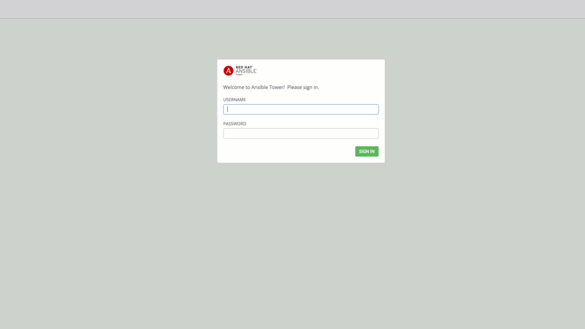
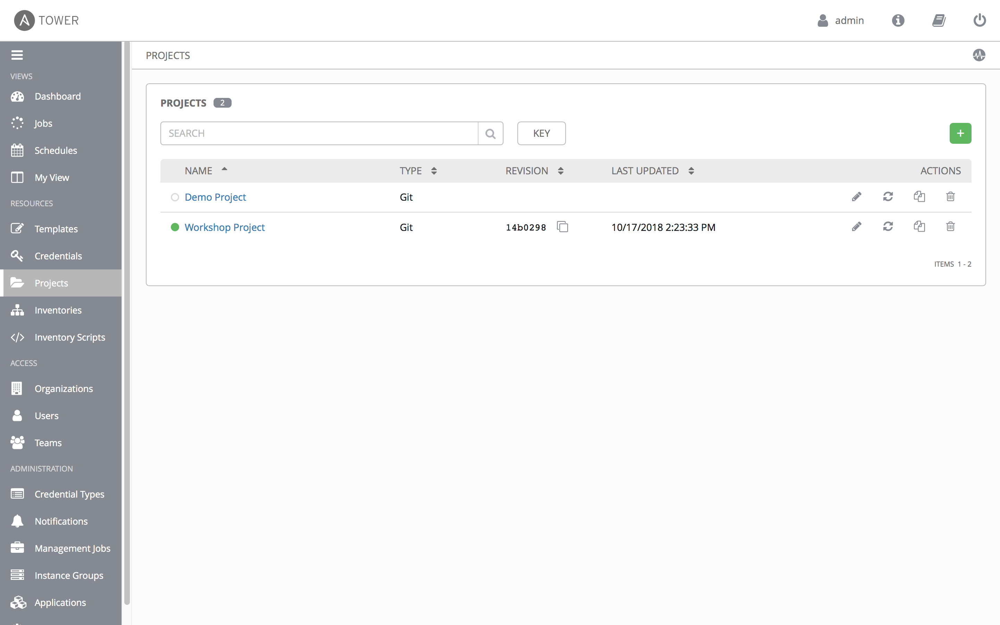
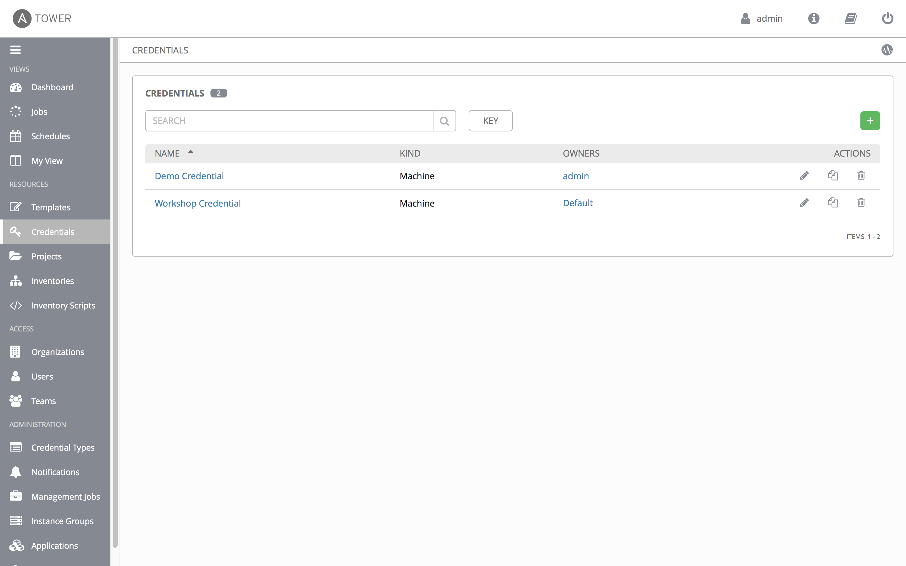
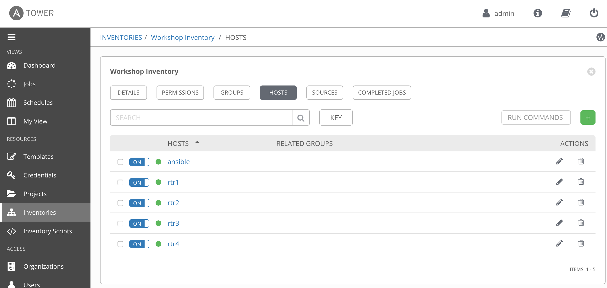

# Exercise 4-0: Red Hat Ansible Tower Automated Setup

## Table of Contents

- [Objective](#Objective)
- [Guide](#Guide)
- [Playbook Output](#Playbook_Output)
- [Solution](#Solution)

# Objective

Automated Setup guide for Red Hat Ansible Tower, please return to master [Read Me](README.md) to understand the full objective and have another option with using the Tower user interface (UI) through the website.

# Guide

## Step 1: Tower Login

Make sure Tower is successfully installed by logging into it.  Open up your web browser and type in the Ansible control node's IP address e.g. https://X.X.X.X.  This is the same IP address has provided by the instructor.

Login information:
- The username will be `admin`
- password provided by instructor

After logging in the Job Dashboard will be the default window as shown below.




## Step 2: Setting up Inventory

An inventory is required for Tower to be able to run jobs.  An Inventory is a collection of hosts against which jobs may be launched, the same as an Ansible inventory file. In addition, Tower can make use of an existing configuration management data base (cmdb) such as ServiceNow or Infoblox DDI.

>More info on Inventories in respect to Tower can be found in the [documentation here](https://docs.ansible.com/ansible-tower/latest/html/userguide/inventories.html)

By default Tower has a **Demo Inventory** setup.  Click on the **Inventories** button under **Resources** on the left menu bar.  An animation is provided below:



Instead of manually re-entering existing hosts into our Tower inventory it is possible to easily automate this with an Ansible Playbook.

```yaml
- name: TOWER CONFIGURATION WITH PLAYBOOKS
  hosts: ansible
  connection: local
  gather_facts: no
  become: no
  tasks:

    - name: CREATE INVENTORY
      tower_inventory:
        name: "Workshop Inventory"
        organization: Default
        tower_username: admin
        tower_password: ansible
        tower_host: "https://{{ansible_fqdn}}"

    - name: ADD CONTROL HOST INTO TOWER
      tower_host:
        name: "{{ inventory_hostname }}"
        inventory: "Workshop Inventory"
        tower_username: admin
        tower_password: ansible
        tower_host: "https://{{ansible_fqdn}}"
        variables:
          ansible_host: "{{ansible_host}}"
          ansible_user: "ec2-user"
          private_ip: "{{private_ip}}"
          ansible_connection: ssh
```

Create an Ansible Playbook called `tower_setup.yml`.  Cut and paste the above into the YML file with your text editor of choice.  To run the playbook use the `ansible-playbook` command:

```bash
ansible-playbook tower_setup.yml
```

Now under the Inventories there will be two inventories, the `Demo Inventory` and the `Workshop Inventory`.  Under the `Workshop Inventory` click the **Hosts** button, it will be empty since we have not added any hosts there.

## Step 3: Setting up a Project

A project is how actually Playbooks are imported into Red Hat Ansible Tower.  You can manage playbooks and playbook directories by either placing them manually under the Project Base Path on your Tower server, or by placing your playbooks into a source code management (SCM) system supported by Tower, including Git, Subversion, Mercurial, and Red Hat Insights.  

> For more information on Projects in Tower, please [refer to the documentation](https://docs.ansible.com/ansible-tower/latest/html/userguide/projects.html)

For this exercise we are going to use an already existing Github repository and turn it into a project in Tower.  For this particular task the [tower_project module](https://docs.ansible.com/ansible/latest/modules/tower_project_module.html) will be used. Append the following to the tower_setup.yml playbook.  

> Linklight is hosted on https://github.com/network-automation/linklight.

```yaml
    - name: ADD REPO INTO TOWER
      tower_project:
        name: "Workshop Project"
        organization: "Default"
        scm_type: git
        scm_url: "https://github.com/network-automation/toolkit"
        tower_username: admin
        tower_password: ansible
        tower_host: "https://{{ansible_fqdn}}"
      run_once: true
      delegate_to: localhost
```

Re-run the playbook using the `ansible-playbook` command.

```
ansible-playbook tower_setup.yml
```

In the Tower UI, click on the Projects link on the lefthand menu.  In addition to the default `Demo Project` a new `Workshop Project` will appear.



## Step 4: Setting up a Credential

Credentials are utilized by Tower for authentication when launching Jobs against machines, synchronizing with inventory sources, and importing project content from a version control system.  For the workshop we need a credential to authenticate to the network devices.

> For more information on Credentials in Tower please [refer to the documentation](https://docs.ansible.com/ansible-tower/latest/html/userguide/credentials.html).

We can manually create this through the web UI or in this case, automate it using an Ansible Playbook.  For this task the [tower_credential module](https://docs.ansible.com/ansible/latest/modules/tower_credential_module.html) will be used. Append the following to the tower_setup.yml playbook.  

**PLEASE CHANGE {{ANSIBLE_USER}} to your student number!!!***

```yaml
    - name: ADD CREDENTIAL INTO TOWER
      tower_credential:
        name: Workshop Credential
        ssh_key_data: "/home/{{ansible_user}}/.ssh/aws-private.pem"
        kind: ssh
        organization: Default
        tower_username: admin
        tower_password: ansible
        tower_host: "https://{{ansible_fqdn}}"
```

Re-run the playbook using the `ansible-playbook` command.

```
ansible-playbook tower_setup.yml
```

In the Tower UI, click on the Credentials link on the lefthand menu.  In addition to the default `Demo Credential` a new `Workshop Credential` will appear.



#### Step 5: Adding existing hosts to inventory

Finally we need to add all of the routers to our inventory.  We can make a new Play in our Playbook and run against all the routers (versus just the control node).  This will simultaneously add all four routers into inventory.  Append the following to your Playbook.

```yaml
- name: ADD EACH HOST TO INVENTORY
  hosts: routers
  connection: local
  become: yes
  gather_facts: no
  tasks:

    - name: ADD HOST INTO TOWER
      tower_host:
        name: "{{ inventory_hostname }}"
        inventory: "Workshop Inventory"
        tower_username: admin
        tower_password: ansible
        tower_host: "https://{{ansible_fqdn}}"
        variables:
          ansible_network_os: "{{ansible_network_os}}"
          ansible_host: "{{ansible_host}}"
          ansible_user: "{{ansible_user}}"
          private_ip: "{{private_ip}}"
          ansible_connection: network_cli
          ansible_become: yes
          ansible_become_method: enable
```




#### Step 6: Run the Playbook

Run the playbook - exit back into the command line of the control host and execute the following:

```
[student1@ansible ~]$ ansible-playbook tower_setup.yml
```
# Playbook Output

The output will look as follows.

```yaml
[student1@ansible ~]$ ansible-playbook tower_setup.yml

PLAY [TOWER CONFIGURATION WITH PLAYBOOKS] **************************************

TASK [CREATE INVENTORY] ********************************************************
changed: [ansible]

TASK [ADD REPO INTO TOWER - PROJECT] *******************************************
changed: [ansible]

TASK [ADD CREDENTIAL INTO TOWER] ***********************************************
changed: [ansible]

PLAY [ADD EACH HOST TO INVENTORY] **********************************************

TASK [ADD HOST INTO TOWER] *****************************************************
changed: [rtr4]
changed: [rtr2]
changed: [rtr1]
changed: [rtr3]

PLAY RECAP *********************************************************************
ansible                    : ok=3    changed=3    unreachable=0    failed=0
rtr1                       : ok=1    changed=1    unreachable=0    failed=0
rtr2                       : ok=1    changed=1    unreachable=0    failed=0
rtr3                       : ok=1    changed=1    unreachable=0    failed=0
rtr4                       : ok=1    changed=1    unreachable=0    failed=0
```

# Solution

The finished Ansible Playbook is provided here for an Answer key.
[solution](tower_setup.yml)


---
[Click Here to return to the Ansible - Network Automation Workshop](../../README.md)
